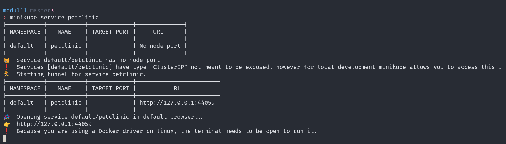

# advprog-modul11

Nama: Muhammad Naufal Ramadhan  
NPM: 2306241700  
Kelas: B

## Reflection on Hello Minikube

1. Compare the application logs before and after you exposed it as a Service. Try to open the app several times while the proxy into the Service is running. What do you see in the logs? Does the number of logs increase each time you open the app?

Sebelum aplikasi diekspos sebagai Service, log aplikasi hanya mencatat proses inisialisasi, yaitu "starting HTTP server on port 8080" dan "starting UDP server on port 8080". Tidak ada log yang menunjukkan adanya `traffic` masuk.

Setelah aplikasi diekspos sebagai Service dan diakses beberapa kali melalui proxy, terlihat adanya log tambahan. Setiap kali aplikasi diakses (misalnya dengan membuka browser atau menggunakan `curl`), log mencatat GET request ke root path (/). Hal ini menunjukkan bahwa aplikasi menerima koneksi dari luar pod. Jumlah log GET request ini akan bertambah sesuai dengan frekuensi akses ke aplikasi, mengonfirmasi bahwa Service berhasil meneruskan traffic ke pod.

2. Notice that there are two versions of `kubectl get` invocation during this tutorial section. The first does not have any option, while the latter has `-n` option with value set to `kube-system`. What is the purpose of the `-n` option and why did the output not list the pods/services that you explicitly created?

Perintah `kubectl get` tanpa opsi `-n` (atau `--namespace`) secara default akan menampilkan resource dari namespace `default`. Ini adalah namespace tempat pod dan service yang saya buat secara eksplisit berada, kecuali jika namespace lain ditentukan saat pembuatan.

Opsi `-n kube-system` pada perintah `kubectl get` bertujuan untuk menampilkan resource yang berada dalam namespace `kube-system`. Namespace `kube-system` adalah tempat komponen-komponen inti dan add-on Kubernetes berjalan, seperti kube-apiserver. Kubernetes menggunakan namespace untuk mengisolasi grup resource dalam satu cluster, sehingga resource aplikasi pengguna terpisah dari resource sistem.

##  Reflection on Rolling Update & Kubernetes Manifest File

1. What is the difference between Rolling Update and Recreate deployment strategy?

Rolling Update dan Recreate adalah dua strategi deployment yang berbeda dalam Kubernetes. Rolling Update merupakan strategi yang bekerja dengan mengganti pod secara bertahap, di mana pod lama dihapus hanya setelah pod baru siap melayani traffic. Strategi ini tidak menyebabkan downtime karena selalu ada pod yang tersedia untuk melayani request pengguna. Strategi ini sangat cocok untuk aplikasi yang dapat menjalankan beberapa versi secara bersamaan tanpa masalah. 

Sementara itu, Recreate adalah strategi yang lebih sederhana namun lebih kasar dalam pendekatannya. Strategi ini bekerja dengan menghentikan semua pod yang ada terlebih dahulu sebelum membuat pod-pod baru dengan versi yang diperbarui. Pendekatan ini menyebabkan downtime selama periode antara terminasi pod lama dan pembuatan pod baru, tapi memastikan tidak ada dua versi aplikasi yang berjalan secara bersamaan. Recreate biasanya cocok untuk aplikasi yang tidak dapat menjalankan versi lama dan baru secara bersamaan. Perbedaan utama antara kedua strategi ini terletak pada ketersediaan aplikasi selama proses deployment, di mana Rolling Update berusaha meminimalkan downtime, sementara Recreate menerima downtime sebagai konsekuensi untuk memastikan pembaruan dilakukan dengan cara yang lebih bersih.

2. Try deploying the Spring Petclinic REST using Recreate deployment strategy and document your attempt.

3. Prepare different manifest files for executing Recreate deployment strategy.

Untuk strategi deployment Recreate, saya telah menyiapkan manifest file yang menggunakan strategi ini. Contoh implementasi strategi Recreate sudah terlihat pada petclinic-recreate.yaml yang saya gunakan di percobaan sebelumnya. Perbedaan utama dalam manifest tersebut adalah pada bagian spec.strategy.type yang diatur menjadi "Recreate" untuk memastikan bahwa semua pod lama dihentikan sepenuhnya sebelum pod-pod baru dibuat.

4. What do you think are the benefits of using Kubernetes manifest files? Recall your experience in deploying the app manually and compare it to your experience when deploying the same app by applying the manifest files (i.e., invoking kubectl apply -f command) to the cluster.

Penggunaan manifest file di Kubernetes memberikan banyak keuntungan dibandingkan dengan deployment manual melalui serangkaian perintah kubectl. Dari pengalaman saya, ketika men-deploy aplikasi secara manual, saya harus mengetikkan beberapa perintah terpisah untuk membuat deployment, service, dan resource lainnya, yang rentan terhadap kesalahan pengetikan dan inkonsistensi konfigurasi. Sementara itu, dengan manifest file, seluruh konfigurasi didefinisikan dalam satu file YAML yang dapat diaplikasikan dengan satu perintah kubectl apply. Pendekatan deklaratif ini memungkinkan saya untuk mendefinisikan keadaan yang diinginkan dari aplikasi dan membiarkan Kubernetes menangani bagaimana mencapainya. Selain itu, manifest file memudahkan dalam melakukan rollback ke versi sebelumnya dan dapat diintegrasikan ke dalam pipeline CI/CD untuk otomatisasi deployment. Secara keseluruhan, penggunaan manifest file membuat proses deployment menjadi lebih efisien, lebih terukur, dan lebih mudah dikelola, terutama untuk aplikasi yang kompleks dengan banyak komponen yang saling terkait.